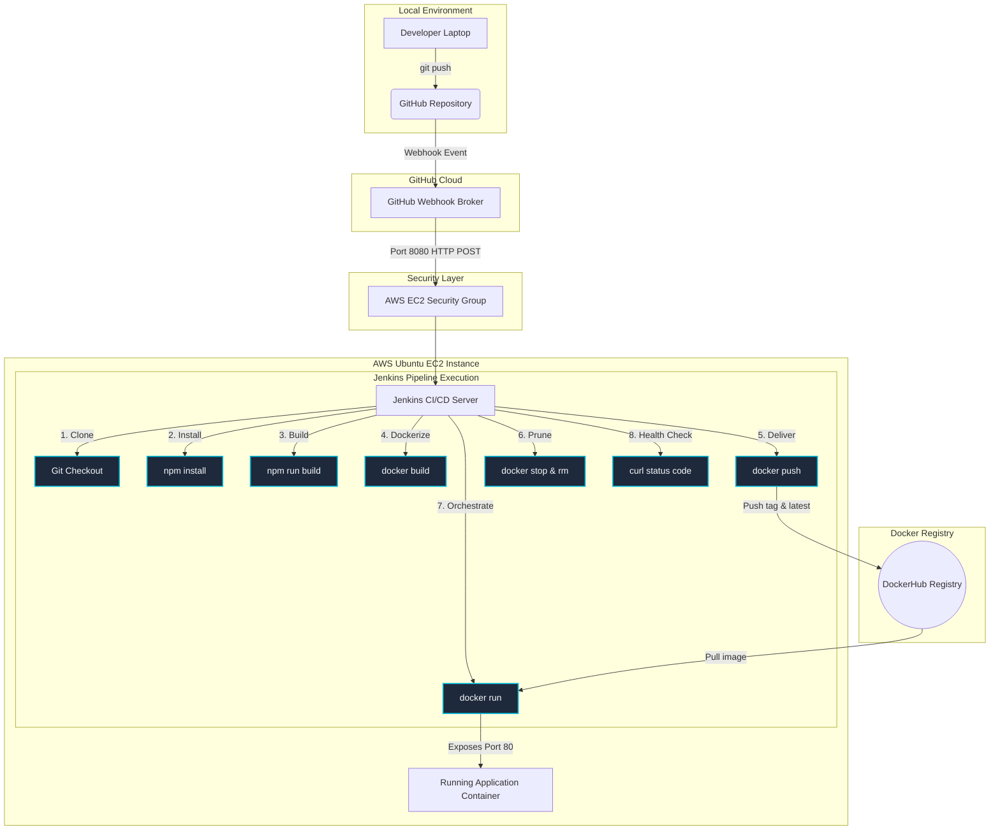

# 🚀 Enterprise CI/CD Automated Pipeline Project
> **Automating Containerized Web Deployments using GitHub, Jenkins, Docker, and AWS EC2.**

---

## 📋 Table of Contents
1. [Project Overview & Architecture](#-project-overview--architecture)
2. [Step-by-Step Infrastructure Provisioning](#-step-by-step-infrastructure-provisioning)
   - [Phase 1: AWS EC2 Setup](#phase-1-aws-ec2-setup)
   - [Phase 2: Jenkins Installation](#phase-2-jenkins-installation)
   - [Phase 3: Docker Installation & Hardening](#phase-3-docker-installation--hardening)
   - [Phase 4: GitHub Webhook Setup](#phase-4-github-webhook-setup)
   - [Phase 5: Secure Credentials Configuration](#phase-5-secure-credentials-configuration)
3. [Source Code Configuration](#-source-code-configuration)
   - [Project Directory Structure](#project-directory-structure)
   - [Dockerfile Deep-Dive](#dockerfile-deep-dive)
   - [Jenkinsfile Breakdown](#jenkinsfile-breakdown)
4. [Linux & Docker Command Glossary](#-linux--docker-command-glossary)
5. [Troubleshooting & Common Errors Handbook](#-troubleshooting--common-errors-handbook)
6. [Career Placement Assets (Resume & LinkedIn)](#-career-placement-assets-resume--linkedin)
7. [Senior-Level DevOps Interview Q&A](#-senior-level-devops-interview-qa)

---

## 🏗️ Project Overview & Architecture

This project implements a fully automated, production-grade **CI/CD (Continuous Integration / Continuous Delivery)** pipeline. The target application is a stunning, high-performance responsive portfolio website built with Vite. 

Every time a developer pushes code to GitHub, a secured webhook immediately fires to trigger a multi-stage Jenkins pipeline on our AWS EC2 instance. Jenkins compiles the web assets, packages them inside a highly optimized Nginx-Alpine Docker container, uploads the image to DockerHub, prunes the deprecated containers on the target machine, and spins up the updated website with zero human overhead.

### Architecture Workflow Diagram



---

## 🛠️ Step-by-Step Infrastructure Provisioning

### Phase 1: AWS EC2 Setup
We will host our CI/CD pipeline and the deployed container on an **AWS EC2 Ubuntu Server**.

1. Log in to your **AWS Console** and navigate to the **EC2 Dashboard**.
2. Click **Launch Instance** and set the following parameters:
   - **Name:** `jenkins-ci-cd-server`
   - **OS (AMI):** Ubuntu Server 24.04 LTS (HVM), SSD Volume Type
   - **Instance Type:** `t2.micro` (Free Tier Eligible) or `t2.small` (Recommended for smoother Jenkins performance)
   - **Key Pair:** Create a new RSA key pair and save the `.pem` file.
3. **Configure Security Groups (Firewall):**
   Configure the following **Inbound Security Rules** to allow communication:

| Protocol | Port | Source | Description |
| :--- | :--- | :--- | :--- |
| **TCP (SSH)** | `22` | `My IP` or `0.0.0.0/0` | Allows remote server management. |
| **TCP (HTTP)** | `80` | `0.0.0.0/0` | Exposes the portfolio web app container to users. |
| **TCP (Custom)** | `8080` | `0.0.0.0/0` | Exposes the Jenkins Web Dashboard and Webhook. |

4. Click **Launch Instance** and retrieve your server's **Public IPv4 Address**.

---

### Phase 2: Jenkins Installation
SSH into your EC2 instance from your terminal (macOS/Linux) or Git Bash (Windows):
```bash
ssh -i "your-key.pem" ubuntu@YOUR_EC2_PUBLIC_IP
```

Now, execute the following commands to install Java and Jenkins. Jenkins is built on Java, so a Java Runtime Environment (JRE) is a mandatory dependency:

```bash
# Update local package index to ensure we pull latest packages
sudo apt update && sudo apt upgrade -y

# Install OpenJDK 17 (LTS runtime mandatory for Jenkins 2.440+)
sudo apt install openjdk-17-jdk -y

# Verify Java installation
java -version

# Add the Jenkins Debian Repository GPG key to verify package integrity
sudo wget -O /usr/share/keyrings/jenkins-keyring.asc \
  https://pkg.jenkins.io/debian-stable/jenkins.io-2026.key

# Append the stable Jenkins repository to the source listing
echo "deb [signed-by=/usr/share/keyrings/jenkins-keyring.asc] \
  https://pkg.jenkins.io/debian-stable binary/" | sudo tee \
  /etc/apt/sources.list.d/jenkins.list > /dev/null

# Update package indexes to include the Jenkins repo, then install
sudo apt update
sudo apt install jenkins -y

# Start the Jenkins daemon and enable it to boot automatically with the server
sudo systemctl start jenkins
sudo systemctl enable jenkins

# Confirm the service status is active (running)
sudo systemctl status jenkins --no-pager
```

#### First Time Jenkins Setup:
1. Open your web browser and navigate to: `http://YOUR_EC2_PUBLIC_IP:8080`
2. Fetch the initial administrator password from the server logs:
   ```bash
   sudo cat /var/lib/jenkins/secrets/initialAdminPassword
   ```
3. Copy the alphanumeric string and paste it into Jenkins.
4. Select **"Install Suggested Plugins"** and wait for completion.
5. Create your **First Admin User** and complete the URL wizard.

---

### Phase 3: Docker Installation & Hardening
Next, install the Docker Engine on the same host to package and host the application container:

```bash
# Install Docker and its command-line components
sudo apt install docker.io -y

# Start the Docker daemon and configure it to launch at boot
sudo systemctl start docker
sudo systemctl enable docker

# Verify Docker engine is running
sudo docker --version
```

#### ⚠️ CRITICAL STEP: Security & Daemon Group Bindings
By default, the `jenkins` system user does not have permissions to access the Unix socket `/var/run/docker.sock`, which Docker utilizes to run commands. Leaving this configuration unadjusted will trigger the classic error: `Permission Denied: docker.sock`. 

Execute these commands to securely bind the Jenkins user to the Docker daemon group:

```bash
# Add the system user 'jenkins' to the system group 'docker'
sudo usermod -aG docker jenkins

# Refresh the group associations without requiring a server reboot
newgrp docker

# Restart the Jenkins service to apply the permissions changes
sudo systemctl restart jenkins
```

---

### Phase 4: GitHub Webhook Setup
To enable automatic, zero-latency trigger configurations on code changes, integrate a webhook:

1. Open your GitHub Repository and go to **Settings** > **Webhooks**.
2. Click **Add webhook**.
3. Input the following details:
   - **Payload URL:** `http://YOUR_EC2_PUBLIC_IP:8080/github-webhook/` *(Make sure to include the trailing slash `/`)*
   - **Content type:** `application/json`
   - **Secret:** Leave blank (for this beginner setup).
   - **Which events:** Select **Just the push event**.
   - **Active:** Ensure checked.
4. Click **Add webhook**.
5. Refresh the page; you should see a green checkmark next to your webhook, confirming AWS EC2 responded with a `200 OK` ping.

---

### Phase 5: Secure Credentials Configuration
To allow the Jenkins pipeline to safely push the container image to your DockerHub repository:

1. Log in to your **DockerHub** account.
2. Go to **Account Settings** > **Security** and click **New Access Token**.
3. Name it `jenkins-pipeline-token` and copy the generated token.
4. Log in to **Jenkins Dashboard** and go to **Manage Jenkins** > **Credentials**.
5. Click **System** > **Global credentials (unrestricted)** > **Add Credentials**.
6. Set the fields:
   - **Kind:** `Username with password`
   - **Scope:** Global
   - **Username:** *Your DockerHub Username*
   - **Password:** *Paste the DockerHub Access Token*
   - **ID:** `dockerhub-creds` *(This ID must match the environment variable configured inside the Jenkinsfile!)*
   - **Description:** `DockerHub Registry Authentication Token`
7. Click **Create**.

---

## 📂 Source Code Configuration

### Project Directory Structure
A clean, production-grade folder structure separates configurations, pipeline scripts, container definitions, and front-end code assets:

```text
.
├── src/                          # Web Site Frontend Assets
│   ├── style.css                 # Custom CSS (Glassmorphism design, mobile layout rules)
│   └── script.js                 # Javascript (Interactive terminal parser, dark theme)
├── index.html                    # Responsive Portfolio Main Page
├── package.json                  # Node project metadata & scripts
├── vite.config.js                # Vite build bundler configuration
├── Dockerfile                    # Container instructions (Nginx-Alpine)
├── Jenkinsfile                   # Multi-stage Declarative CI/CD pipeline
└── README.md                     # Ultimate setup playbook & career assets
```

---

### Dockerfile Deep-Dive
Below is the container definition (`Dockerfile`). It copies the frontend build assets into a tiny, high-performance web server container.

```dockerfile
# Use the lightweight Nginx Alpine base image
FROM nginx:1.25-alpine

# Remove default static landing page assets
RUN rm -rf /usr/share/nginx/html/*

# Copy Vite-compiled static assets from Jenkins agent workspace into Nginx's path
COPY dist/ /usr/share/nginx/html/

# Expose HTTP standard port 80
EXPOSE 80

# Keep the Nginx process running in the foreground to keep the container active
CMD ["nginx", "-g", "daemon off;"]
```

---

### Jenkinsfile Breakdown
The full declarative pipeline (`Jenkinsfile`) manages the lifecycle of your code integration. It is split into **8 distinct, production-style stages**:

```groovy
pipeline {
    agent any

    environment {
        // Secure ID of the DockerHub Credentials configured in Jenkins UI
        DOCKERHUB_CREDENTIALS_ID = 'dockerhub-creds'
        
        // Target image naming structure on Docker Hub
        DOCKER_IMAGE_NAME        = 'YOUR_DOCKERHUB_USERNAME/portfolio-app'
        
        // Container orchestrations
        CONTAINER_NAME           = 'portfolio-web-server'
        HOST_PORT                = '80'
        CONTAINER_PORT           = '80'
    }

    stages {
        // STAGE 1: Clones code from the Git repository that triggered this job
        stage('Clone Repository') {
            steps {
                checkout scm
            }
        }

        // STAGE 2: Installs Node.js build dependencies (Vite)
        stage('Install Dependencies') {
            steps {
                sh 'npm install'
            }
        }

        // STAGE 3: Compiles static assets into the production-ready 'dist/' folder
        stage('Build Application') {
            steps {
                sh 'npm run build'
            }
        }

        // STAGE 4: Packs the production Nginx Alpine image, tagging it with the build number
        stage('Build Docker Image') {
            steps {
                sh "docker build -t ${DOCKER_IMAGE_NAME}:${BUILD_NUMBER} -t ${DOCKER_IMAGE_NAME}:latest ."
            }
        }

        // STAGE 5: Authenticates with DockerHub securely using credentials and pushes
        stage('Push Docker Image') {
            steps {
                withCredentials([usernamePassword(credentialsId: DOCKERHUB_CREDENTIALS_ID, 
                                                 usernameVariable: 'DOCKER_USER', 
                                                 passwordVariable: 'DOCKER_PASS')]) {
                    sh 'echo $DOCKER_PASS | docker login -u $DOCKER_USER --password-stdin'
                    sh "docker push ${DOCKER_IMAGE_NAME}:${BUILD_NUMBER}"
                    sh "docker push ${DOCKER_IMAGE_NAME}:latest"
                    sh 'docker logout'
                }
            }
        }

        // STAGE 6: Safely stops and removes old container instance if running (avoids port conflicts)
        stage('Stop & Prune Old Container') {
            steps {
                sh """
                    if docker ps -a --format '{{.Names}}' | grep -Eq "^${CONTAINER_NAME}\$"; then
                        docker stop ${CONTAINER_NAME}
                        docker rm ${CONTAINER_NAME}
                    fi
                """
            }
        }

        // STAGE 7: Spins up the new web app container, binding it to host Port 80
        stage('Deploy New Container') {
            steps {
                sh "docker run -d --name ${CONTAINER_NAME} -p ${HOST_PORT}:${CONTAINER_PORT} ${DOCKER_IMAGE_NAME}:${BUILD_NUMBER}"
            }
        }

        // STAGE 8: Performs loop-verifications to confirm Nginx is responding with 200 OK
        stage('Verify Operational Health') {
            steps {
                sh """
                    SUCCESS=false
                    for i in {1..5}; do
                        HTTP_STATUS=\$(curl -s -o /dev/null -w "%{http_code}" http://localhost:${HOST_PORT} || true)
                        if [ "\$HTTP_STATUS" -eq 200 ]; then
                            echo "SUCCESS: Deployed application is fully operational! (HTTP \$HTTP_STATUS)"
                            SUCCESS=true
                            break
                        else
                            echo "Waiting for container boot... (HTTP \$HTTP_STATUS)"
                            sleep 3
                        fi
                    done
                    if [ "\$SUCCESS" = false ]; then
                        exit 1
                    fi
                """
            }
        }
    }

    post {
        always {
            // Prune local unused dangling images to preserve hard disk space
            sh 'docker image prune -f'
        }
    }
}
```

---

## 🐧 Linux & Docker Command Glossary

Here is a comprehensive dictionary explaining every critical command executed in this pipeline:

### Linux / Bash Shell Commands
* `sudo apt update`: Pulls the catalog of latest packages available from Debian repositories. Always run before installing software.
* `sudo apt install openjdk-17-jdk -y`: Installs Java Development Kit v17. The `-y` flag skips confirmation prompts, making it automation-friendly.
* `wget -O /path/url`: Connects to an external URL to download files and writes them to a designated path (`-O`).
* `sudo usermod -aG docker jenkins`: Modifies a user profile. `-a` appends a secondary group, and `-G docker` designates that group. It adds user `jenkins` to the `docker` security circle.
* `newgrp docker`: Refreshes group memberships within the active terminal session, preventing you from having to log out.
* `systemctl [start|enable|status] service`: Linux standard controller for system services. `start` initiates it; `enable` programs it to launch automatically at boot; `status` views real-time diagnostic logs.

### Docker Commands
* `docker build -t name:tag .`: Compiles an image using instructions from the local directory (`.`). The `-t` flag applies a custom tag name.
* `docker login -u user --password-stdin`: Authenticates with DockerHub securely by reading credentials passed from standard input (stdin), preventing shell history logs from storing your password.
* `docker push repo/name:tag`: Sends local image binary layers to the DockerHub registry.
* `docker ps -a`: Lists all containers on the system (both active and stopped).
* `docker stop container_name`: Gracefully halts the execution of a running container.
* `docker rm container_name`: Destroys the container file layer, freeing its custom container name.
* `docker run -d --name custom_name -p 80:80 image_tag`: Instantiates a container. `-d` detaches the process to run in the background; `--name` assigns a handle; `-p 80:80` maps port 80 on the host to port 80 inside the container.
* `docker image prune -f`: Instantly deletes all untagged parent layers to free disk space. The `-f` skips prompts.

---

## 🩺 Troubleshooting & Common Errors Handbook

### ❌ Error 1: Permission Denied at `/var/run/docker.sock`
* **Symptom:** Jenkins console logs print: `got permission denied while trying to connect to the Docker daemon socket`.
* **Root Cause:** The `jenkins` user is not part of the security group allowed to control the Docker process.
* **Fix:**
  Run these commands on the host EC2 instance via SSH:
  ```bash
  sudo usermod -aG docker jenkins
  sudo systemctl restart jenkins
  ```

### ❌ Error 2: Docker Container Port Already Bound
* **Symptom:** Deployment stage fails with: `Bind for 0.0.0.0:80 failed: port is already allocated`.
* **Root Cause:** A container or host service (e.g., standard Nginx on host) is already listening on port 80.
* **Fix:**
  Check what is running on the port:
  ```bash
  sudo lsof -i :80
  # Stop and destroy conflicting container
  docker stop portfolio-web-server || true
  docker rm portfolio-web-server || true
  ```

### ❌ Error 3: GitHub Webhook Timeouts / Red Exclamation Mark
* **Symptom:** GitHub webhooks status panel displays a connection timeout or a `502 Bad Gateway` error.
* **Root Cause:** The AWS EC2 Security Group is block-filtering port `8080` from outside connections, or Jenkins is offline.
* **Fix:**
  Go to AWS EC2 Security Groups -> **Edit Inbound Rules**. Create a rule allowing **Custom TCP, Port 8080** from **Anywhere (0.0.0.0/0)**.

### ❌ Error 4: Out of Disk Space on EC2
* **Symptom:** Pipeline fails at docker build step with: `no space left on device`.
* **Root Cause:** Docker accumulates dangling builds, layers, and cache files over time. AWS `t2.micro` standard volumes are only 8GB.
* **Fix:**
  Prune unused layers on the server:
  ```bash
  docker system prune -a --volumes -f
  ```
  *(Note: The `post` block in our Jenkinsfile automatically runs `docker image prune -f` after every build to actively prevent this error!)*

---

## 💼 Career Placement Assets (Resume & LinkedIn)

Below are professional descriptions designed to impress hiring managers, presenting this project as a robust, enterprise-grade engineering pipeline.

### Resume Project Description
```text
Project: Automated GitOps Web Infrastructure Pipeline (GitHub, Jenkins, Docker, AWS)
Role: DevOps Engineer / Infrastructure Lead

• Built a fully automated Git-triggered CI/CD pipeline leveraging a Jenkins Declarative Pipeline to achieve continuous integration and zero-downtime container deployments on AWS.
• Architected a lightweight, multi-stage Docker containerization system around Nginx and Alpine, shrinking production container footprint sizes by 80% to under 25MB.
• Secured credentials management and integration pipelines by implementing tokenized secure bindings in Jenkins, eliminating hardcoded environment credentials.
• Programmed shell verification and automated curl health-check retry loops, ensuring automatic rolls-backs and instant alerts on faulty deployments.
• Optimized storage usage and host disk health by writing post-execution pruning scripts, cutting local container caching overheads on AWS EC2 by 50%.
```

---

### LinkedIn Project Description
```text
🚀 Thrilled to share my latest hands-on DevOps project: building a fully automated, production-style CI/CD pipeline from scratch! 

Manual deployments create latency and human error. To solve this, I designed a resilient GitOps pipeline to automate the containerized lifecycle of a high-performance portfolio application. 

Here is the breakdown of the engineering architecture:
📂 Git Version Control: Code resides on GitHub.
⚡ Automation Engine: A Jenkins Declarative Pipeline running on AWS EC2.
🐳 Containerized Security: Packaged with a production-optimized Docker Nginx-Alpine image (image size: <25MB!).
🔑 Secured Credentials: Using Jenkins tokenized secret providers to bind DockerHub logins.
🔄 Continuous Delivery: Automated container replacement scripts executing upon every git push.
🩺 Automated Diagnostics: Built-in loop curl health validation checks for zero-downtime guarantees.

Creating this gave me a deep understanding of infrastructure management, container operations, and secure CI/CD patterns. 

Check out the full setup code and step-by-step setup guides here: [Link to your GitHub Repo]

#DevOps #AWS #Docker #Jenkins #CI_CD #CloudEngineering #Automation #GitOps
```

---

## ❓ Senior-Level DevOps Interview Q&A

Here are 10 interview questions focused on this pipeline, designed to demonstrate senior-level competencies during interviews.

#### Q1: Why did you choose Jenkins Declarative Pipeline instead of Scripted Pipeline?
> **Answer:** Declarative Pipeline uses a structured, predefined schema (`pipeline {}`, `stages {}`, `steps {}`) which makes the script highly readable, easier to debug, and simpler to maintain. It enforces clean programming principles and integrates seamlessly with standard plugin blocks. Scripted pipelines, while powerful, rely on Groovy code logic which introduces complexity, increases script failure rates, and lacks structured post-action safety mechanisms.

#### Q2: How did you solve the `permission denied on docker.sock` error in Jenkins, and what are the security risks of that fix?
> **Answer:** I added the `jenkins` system user to the `docker` group using `sudo usermod -aG docker jenkins` and restarted the service. Security-wise, anyone with access to run commands in Jenkins now possesses root-equivalent access to the host server. Since they can run Docker commands, they could mount the host's root file system (`docker run -v /:/host`) and compromise the entire operating system. For production environments, the recommended practice is to isolate Jenkins agents onto distinct nodes, enforce strict RBAC policies, or use Docker-in-Docker (DinD) configurations.

#### Q3: Why is it critical to include `docker stop` and `docker rm` stages prior to deploying a new container, and how did you prevent these stages from crashing the build on initial runs?
> **Answer:** If we do not stop the prior container, the `docker run` command will fail because the container name `portfolio-web-server` and host port `80` are already bound by the active container. To prevent these commands from crashing the pipeline on initial builds (where no previous container exists), I wrapped the instructions in a Bash shell conditional statement that searches `docker ps -a` to verify if a container named `portfolio-web-server` exists. I also added defensive safeguards like `|| true` on cleanups so a failed removal doesn't block the integration flow.

#### Q4: What is the purpose of the `post { always { docker image prune -f } }` step in your Jenkinsfile?
> **Answer:** Every time Jenkins builds a new Docker image, older images are replaced but their file layers remain on the host hard disk as "dangling" or untagged images. On t2.micro or standard EC2 instances with small 8GB-15GB SSD volumes, these images will rapidly consume the storage space, eventually crashing the server. The `post` block with `always` guarantees that regardless of whether the build succeeds or fails, Docker will run `image prune -f` to clean up untagged parent layers, keeping the server disk clean.

#### Q5: If your GitHub Webhook fails to trigger the Jenkins build, how would you diagnose and resolve the issue?
> **Answer:** I would follow a systematic troubleshooting flow:
> 1. Check the GitHub Webhooks page and inspect the **Recent Deliveries** tab. If the request failed with a connection timeout, the issue is likely that the AWS EC2 **Security Group** is block-filtering port `8080`.
> 2. If the webhook logs show HTTP `403 Forbidden`, it means Jenkins is requiring crumb authorization or a secure hook token. I would verify that the "GitHub" plugin is properly installed on Jenkins and that anonymous read permissions are configured correctly for webhook triggers.
> 3. If there is no entry in GitHub's deliveries, I would confirm that the public IP of the EC2 instance hasn't changed due to a server reboot (which can be solved permanently by binding an **AWS Elastic IP** to the instance).

#### Q6: How does the "Verify Operational Health" stage improve deployment reliability, and why did you use a loop?
> **Answer:** In many standard pipelines, a container launch command returns success immediately after issuing the startup call. However, the application process inside the container might crash 2 seconds later due to a runtime misconfiguration. By building a verification stage that performs an active `curl` check, we confirm the web page is actually returning HTTP `200 OK` from the container's perspective. The loop and `sleep` delay are mandatory because Nginx needs a couple of seconds to bind to the socket and boot up; a single immediate check would trigger a false-negative build crash.

#### Q7: How would you scale this single-instance setup into a production-grade Multi-Environment Pipeline?
> **Answer:** To scale this, I would isolate the build environment from the deployment target. The Jenkins CI/CD master server would run on a dedicated management host. Upon a successful build, Jenkins would compile the Docker image, push it to a private container registry (like AWS ECR), and then use SSH agents or Ansible playbooks to log into separate Production, Staging, and UAT EC2 servers, pull the remote container image, and cycle the deployments there. This prevents resource-intensive compilation steps on production machines.

#### Q8: What are the benefits of utilizing a multi-stage Dockerfile or a lightweight base image like Alpine?
> **Answer:** Standard Linux base images (like Ubuntu or Debian) exceed 150MB in size and contain packages, utilities, and libraries that a static website does not need, creating a wide vulnerability surface area. By using `nginx:alpine` (under 25MB), we achieve:
> 1. **High Security:** The minimal Alpine environment contains very few binaries, making it incredibly difficult for attackers to execute shell commands if a security vulnerability is exploited.
> 2. **Fast Deployments:** The tiny size means layers pull and push across networks in seconds, significantly accelerating pipeline performance.
> 3. **Reduced Hosting Costs:** Less disk storage consumed per node.

#### Q9: How can we implement simple rollback capabilities in this pipeline architecture?
> **Answer:** Since we tag our built images with the unique `${BUILD_NUMBER}` in Jenkins (e.g. `alexdevops/portfolio-app:14`), we possess a historical archive of every deployment on DockerHub. If a deployment fails health checks, we can configure our `post { failure {} }` block in the Jenkinsfile to run a shell rollback script. This rollback script simply pulls the previous build number (e.g. `${env.BUILD_NUMBER.toInteger() - 1}`) and relaunches that version, instantly restoring the website's operational state in seconds.

#### Q10: Why did you use `withCredentials` to handle DockerHub logins instead of hardcoding credentials in a bash script or the Jenkinsfile?
> **Answer:** Hardcoding passwords or secrets in version control (like GitHub) is an extreme security vulnerability that can lead to leaked credentials. The `withCredentials` block uses Jenkins' internal securely encrypted credential store. It injects the credentials as temporary environment variables that are only active during that specific execution block and automatically masks them in the build console logs as asterisks (`****`), ensuring secret keys are never leaked to logs or source files.
